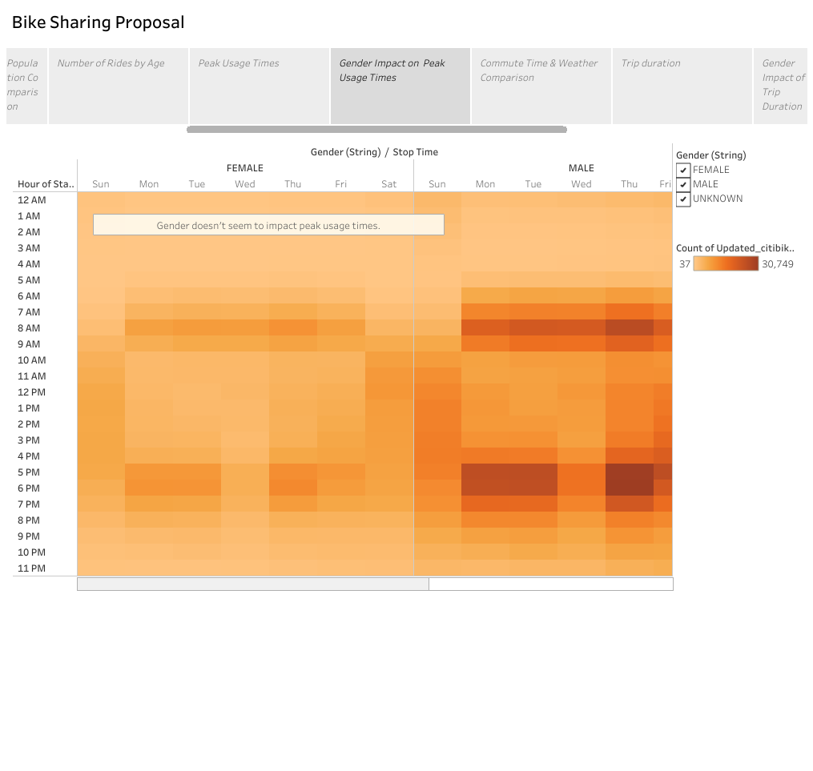

# Bike Sharing

Tableau Public URL: https://public.tableau.com/profile/whitney.c.losinski#!/vizhome/Citi_Bike_Study/BikeSharingStudy

### Purpose
The purpose of this project was to use Tableau to analyze Citibike data from NYC and create a pitch to possible investors showing that a bike sharing service in Des Moines, IA would be a good investment opportunity.  Below are some of the key metrics evaluated in the analysis.

1. Number of users
2. Number of subscribers
3. Population comparison
4. Age of users
5. Gender of users
6. Peak usage times
7. Commute time comparison
8. Weather comparison
9. Length of usage
10. Trips by user type per weekday

### Results
|||
|:---|:---|
|The following is a business proposal for a bike sharing  business in Des Moines, IA using an analysis of a similar business in NYC and taking into account factors such as population, age of users, gender of users, weather, commute times, etc.|Clearly, bike sharing in NYC is popular with over 2 million users in the month of August alone!  The data showed that nearly 75% of users were male and 75% of users were subscribers.|

|||
|:---|:---|
|Comparing the populations between NYC and Des Moines, we can see that Des Moines has a much smaller population, but a slightly younger customer base with a higher percentage of male population.  This gender and age breakdown in Des Moines will be beneficial for business.|Some of the age data appears to be skewed, possibly from users entering the wrong birth year or using the default birth year when signing up, but we can still see a trend of younger riders being the most common users.  This is great news for a Des Moines bike sharing business with the younger population.|

|||
|:---|:---|
|Looking at peak usage times, it appears that most  riders tend to use the bikes to get to and from work throughout the week.  Weekend use tends to be more spread out throughout the day, possibly from tourists, events or other weekend activities.|The peak hours seem to be the same for both male and female users.  This chart once again shows how many more males are using the ride sharing services than females.|

|||
|:---|:---|
|Since users seem to be riding the bikes to get to and from  work, it is important to take a look at average commute times  and weather between NYC and Des Moines.  NYC has an average commute time of 35 minutes while Des Moines' average commute time is 19 minutes.  The weather also tends to be slightly colder in Des Moines during the winter months than in NYC.  Although the weather may deter some customers, the commute time shows that there is still a possible market for customers who want to cut down their commute time by escaping the busy traffic.|The data showed that the average checkout time for each bike ride is between 3 to 9 minutes (The graph shows hours per the module instructions, but that is incorrect).  With an average commute time of 19 minutes in Des Moines and an average ride time of about 5 minutes for the NYC data, users would likely be able to shorten their commute significantly.  Again, this shows a great opportunity for a bike sharing business in Des Moines.|

|||
|:---|:---|
|Again, the average checkout times for each bike ride tend to be the same for both male and female users.|This slide shows that the overwhelming majority of  trips taken throughout the week are by subscribing  customers.  Non-subscribers tend to use the bikes  more frequently on the weekends.  With less of  a draw for tourism in Des Moines than in NYC,  this data is encouraging for starting a bike sharing business.  It suggests that most users will be local, loyal customers who live near the city.|

### Summary
Provide a high-level summary of the results and two additional visualizations that you would perform with the given dataset.

